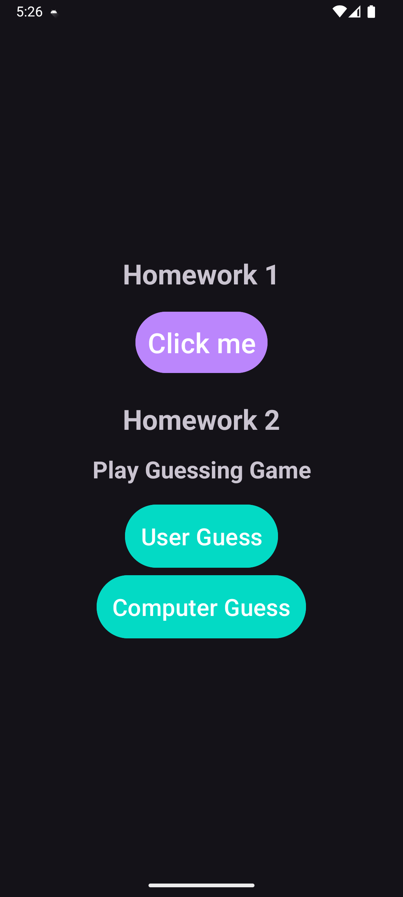
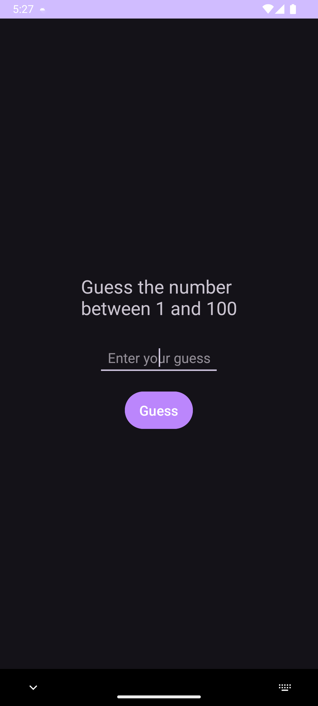
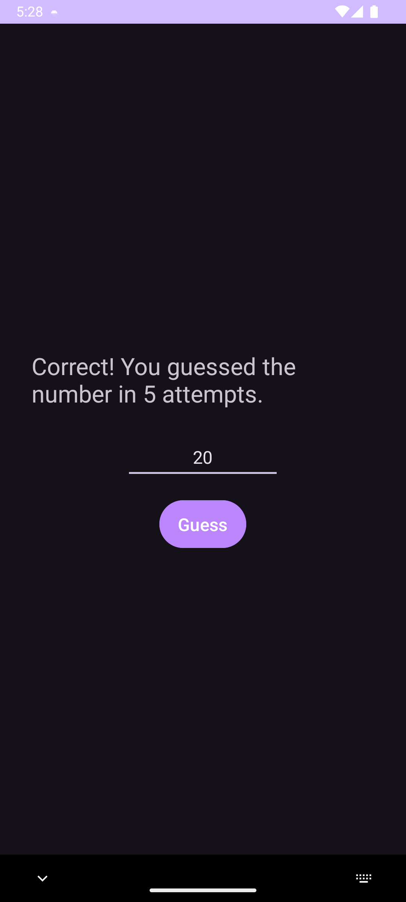
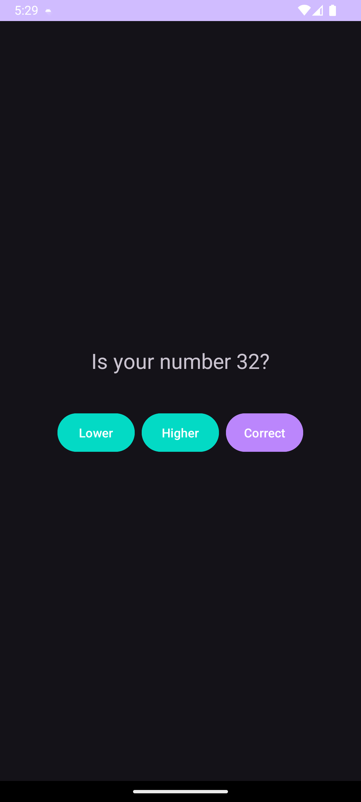
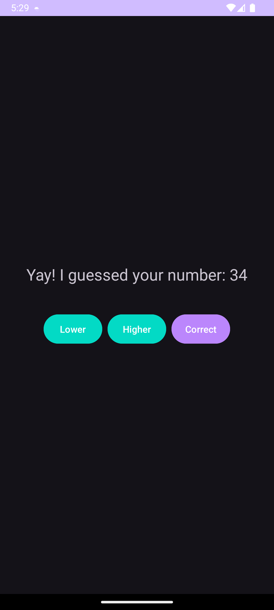

# Android Studio | Homework 02

* [Java Files](./app/src/main/java/com/slavikart/hw_02/)
* [Layout Files](./app/src/main/res/layout/)
* [Value Files](./app/src/main/res/values/)

## Main Screen

## User Guess
  
  

## Computer Guess
  
  

