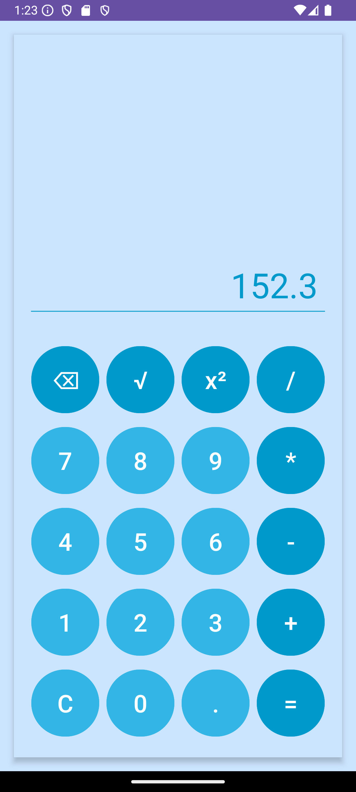
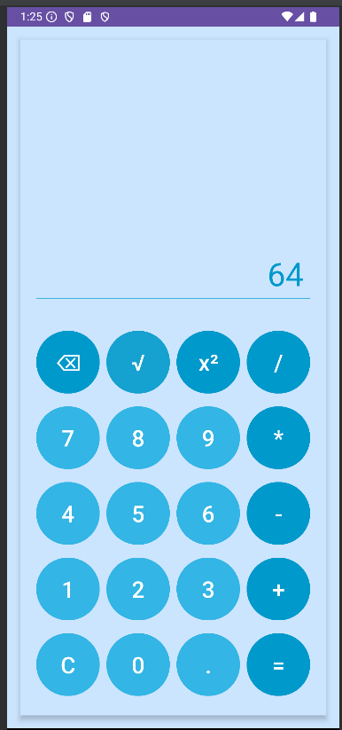
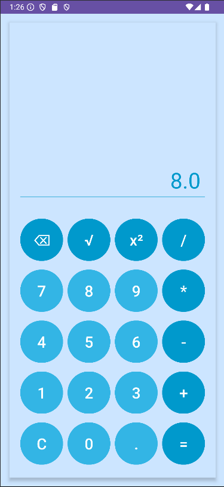

# Android Studio | Homework 03

* [Java Files](./app/src/main/java/com/slavikart/hw_03/)
    - [MainActivity.java](./app/src/main/java/com/slavikart/hw_03/MainActivity.java)

* [Layout Files](./app/src/main/res/layout/)
    - [activity_main.xml](./app/src/main/res/layout/activity_main.xml)

* [Value Files](./app/src/main/res/values/)
    - [colors.xml](./app/src/main/res/values/colors.xml)
    - [strings.xml](./app/src/main/res/values/strings.xml)
    - [styles.xml](./app/src/main/res/values/styles.xml)

## Calculator App

  
  
