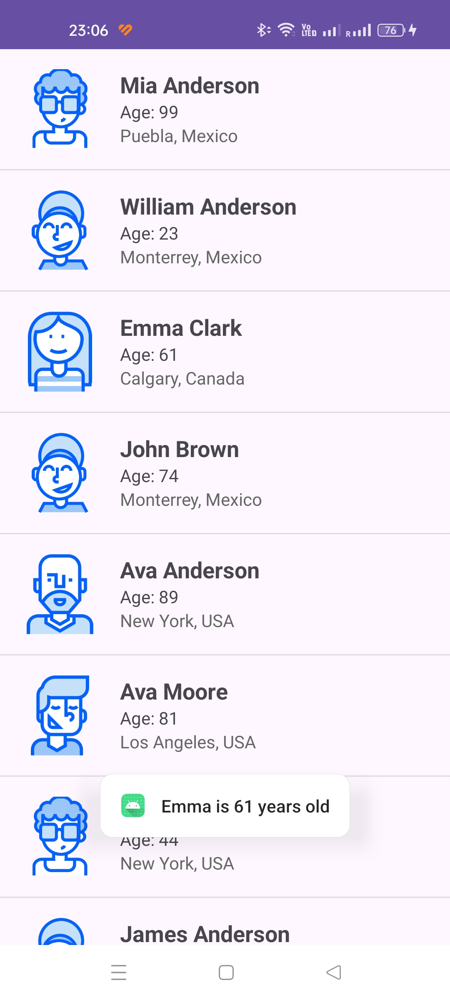

# Android Studio | Homework 05

* [Java Files](./app/src/main/java/com/slavikart/hw_05/)
    - [MainActivity.java](./app/src/main/java/com/slavikart/hw_05/MainActivity.java)
    - [UserAdapter.java](./app/src/main/java/com/slavikart/hw_05/UserAdapter.java)
    - [UserModel.java](./app/src/main/java/com/slavikart/hw_05/UserModel.java)

* [Layout Files](./app/src/main/res/layout/)
    - [activity_main.xml](./app/src/main/res/layout/activity_main.xml)
    - [list_item_user.xml](./app/src/main/res/layout/list_item_user.xml)

* [Value Files](./app/src/main/res/values/)
    - [colors.xml](./app/src/main/res/values/colors.xml)
    - [strings.xml](./app/src/main/res/values/strings.xml)

## Users List

==========================================

