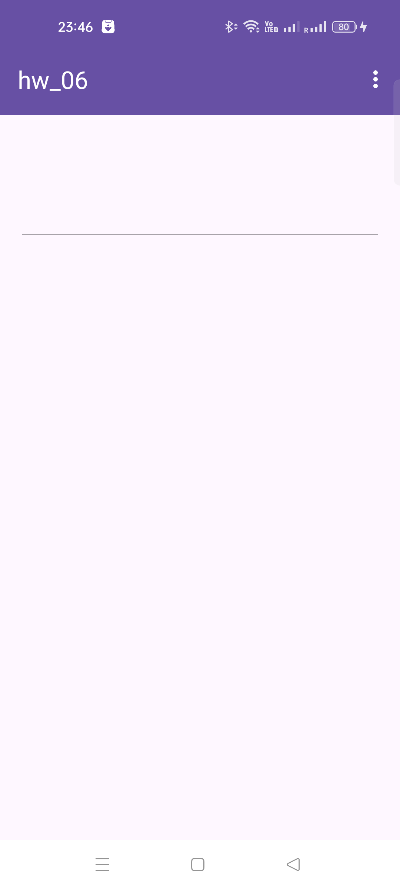
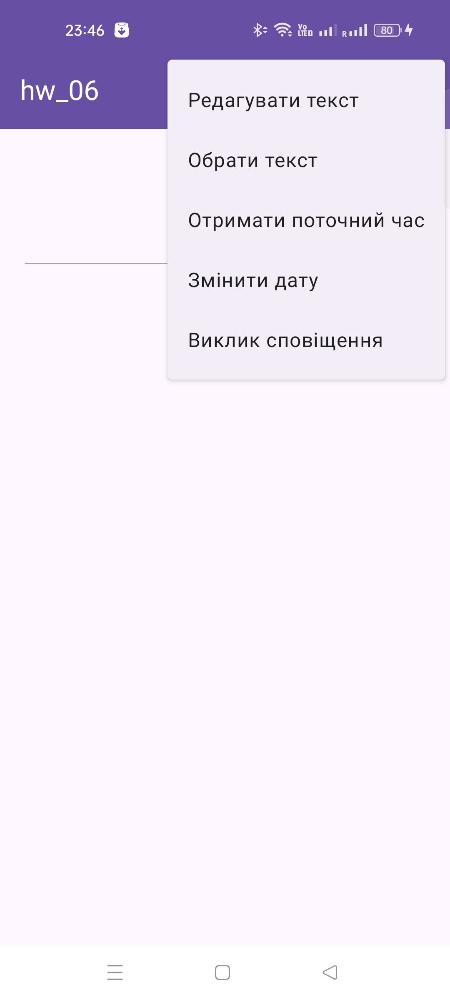
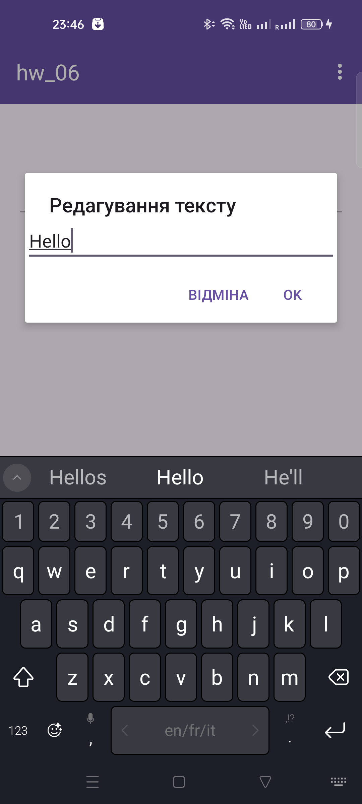
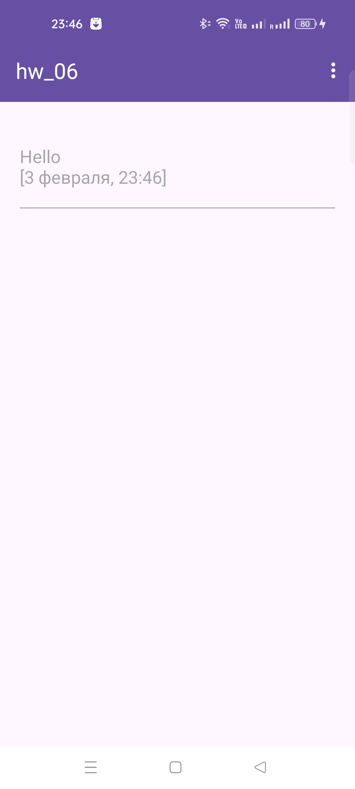
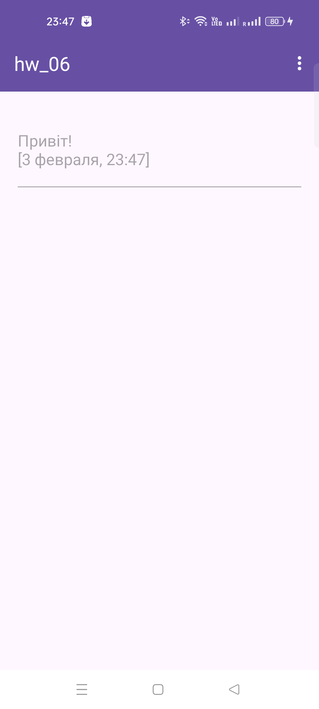
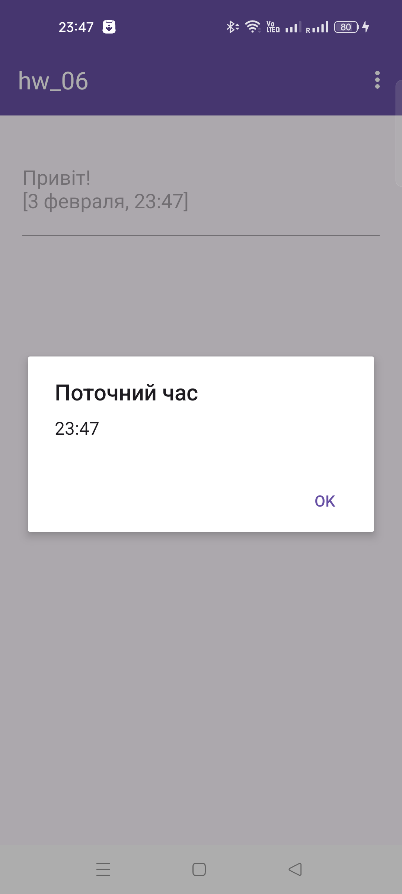
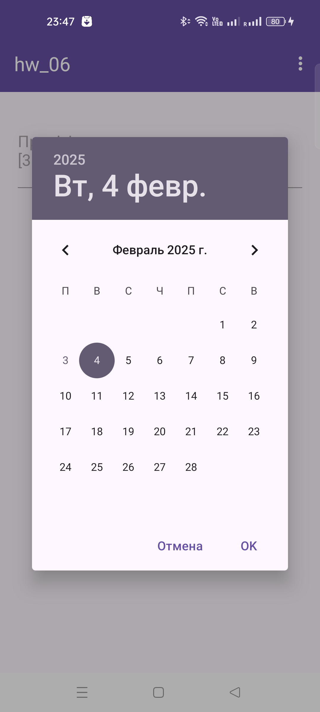
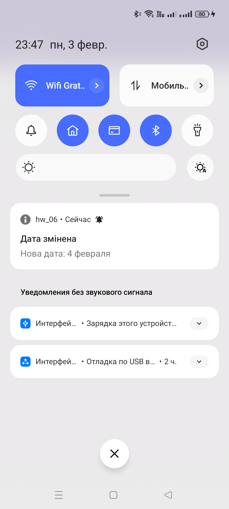
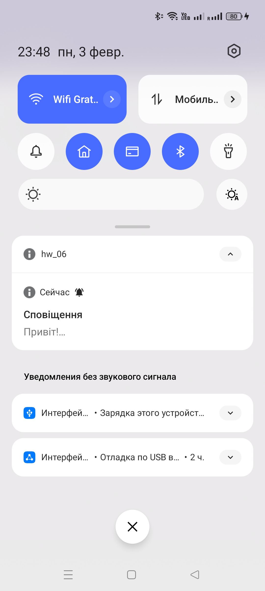

# Android Studio | Homework 06

* [Java Files](./app/src/main/java/com/slavikart/hw_06/)
    - [MainActivity.java](./app/src/main/java/com/slavikart/hw_06/MainActivity.java)

* [Layout Files](./app/src/main/res/layout/)
    - [activity_main.xml](./app/src/main/res/layout/activity_main.xml)

* [Menu Files](./app/src/main/res/menu/)
    - [main_menu.xml](./app/src/main/res/menu/main_menu.xml)

* [Value Files](./app/src/main/res/values/)
    - [colors.xml](./app/src/main/res/values/colors.xml)
    - [strings.xml](./app/src/main/res/values/strings.xml)
    - [themes.xml](./app/src/main/res/values/themes.xml)

## Menu Dialogs Notifications

