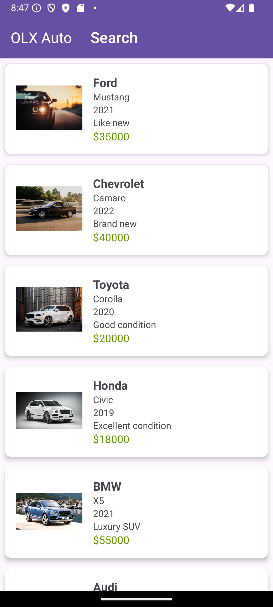
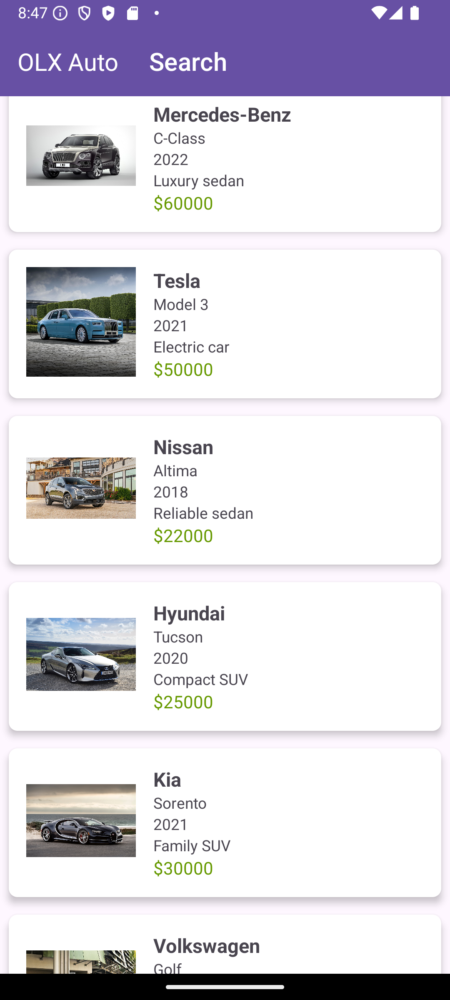
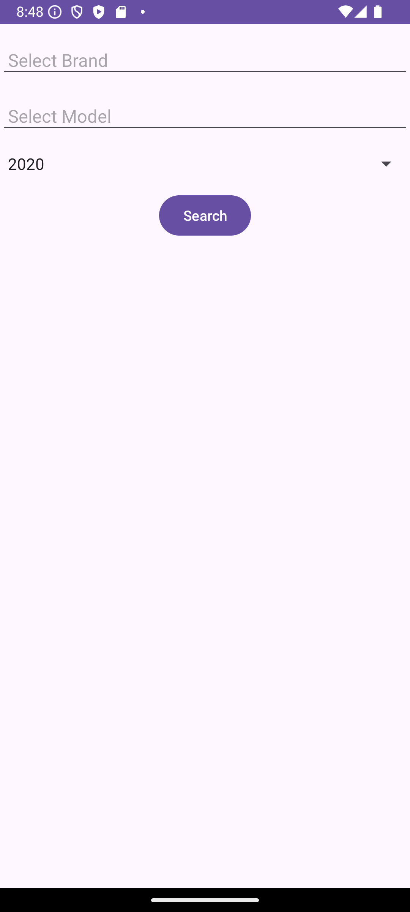
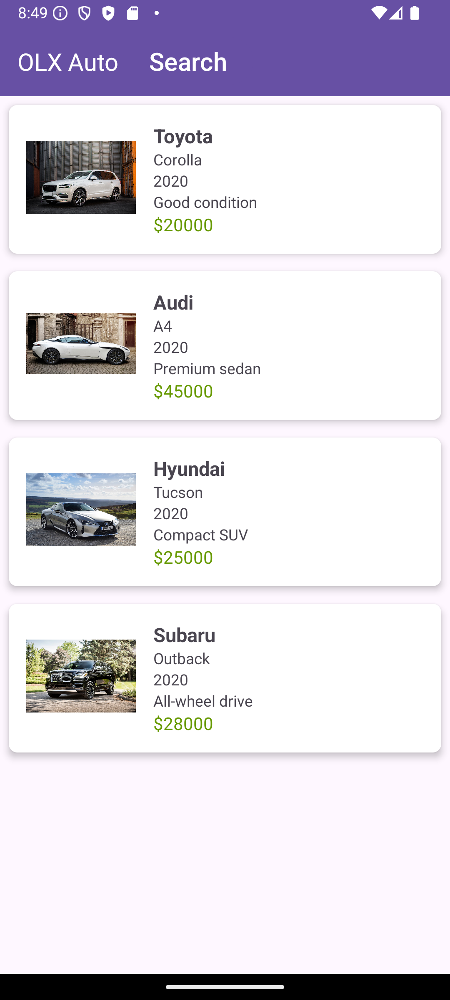

# Android Studio | Homework 07

* [Java Files](./app/src/main/java/com/slavikart/hw_07/)
    - [MainActivity.java](./app/src/main/java/com/slavikart/hw_07/MainActivity.java)
    - [SearchActivity.java](./app/src/main/java/com/slavikart/hw_07/SearchActivity.java)
    - [Car.java](./app/src/main/java/com/slavikart/hw_07/Car.java)
    - [CarAdapter.java](./app/src/main/java/com/slavikart/hw_07/CarAdapter.java)

* [Layout Files](./app/src/main/res/layout/)
    - [activity_main.xml](./app/src/main/res/layout/activity_main.xml)
    - [activity_search.xml](./app/src/main/res/layout/activity_search.xml)
    - [car_item.xml](./app/src/main/res/layout/car_item.xml)

* [Value Files](./app/src/main/res/values/)
    - [colors.xml](./app/src/main/res/values/colors.xml)
    - [strings.xml](./app/src/main/res/values/strings.xml)

## OLX Auto

