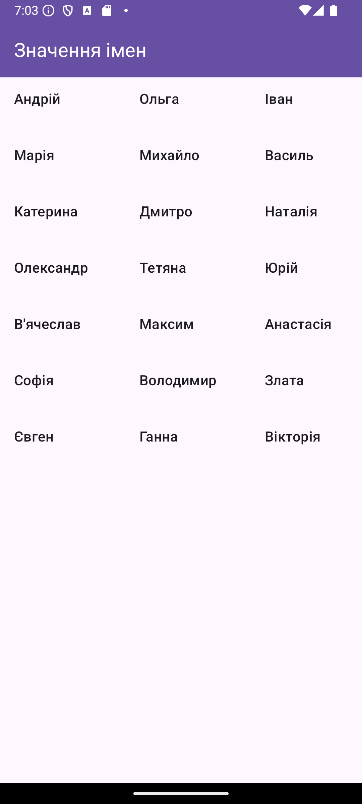

# Android Studio | Homework 08

* [Java Files](./app/src/main/java/com/slavikart/hw_08/)
    - [MainActivity.java](./app/src/main/java/com/slavikart/hw_08/MainActivity.java)
    - [NameModel.java](./app/src/main/java/com/slavikart/hw_08/NameModel.java)
    - [NamesListFragment.java](./app/src/main/java/com/slavikart/hw_08/NamesListFragment.java)
    - [NameDetailsFragment.java](./app/src/main/java/com/slavikart/hw_08/NameDetailsFragment.java)

* [Layout Files](./app/src/main/res/layout/)
    - [activity_main.xml](./app/src/main/res/layout/activity_main.xml)
    - [fragment_names_list.xml](./app/src/main/res/layout/fragment_names_list.xml)
    - [fragment_name_details.xml](./app/src/main/res/layout/fragment_name_details.xml)

* [Value Files](./app/src/main/res/values/)
    - [colors.xml](./app/src/main/res/values/colors.xml)
    - [strings.xml](./app/src/main/res/values/strings.xml)
    - [themes.xml](./app/src/main/res/values/themes.xml)

## Names Meaning

