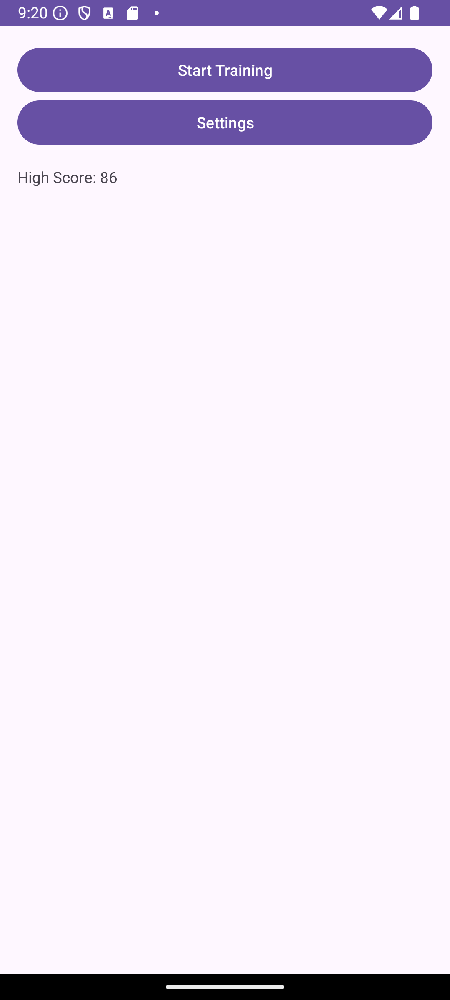
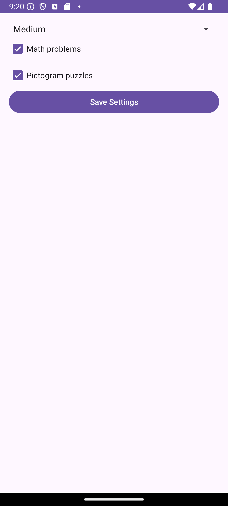
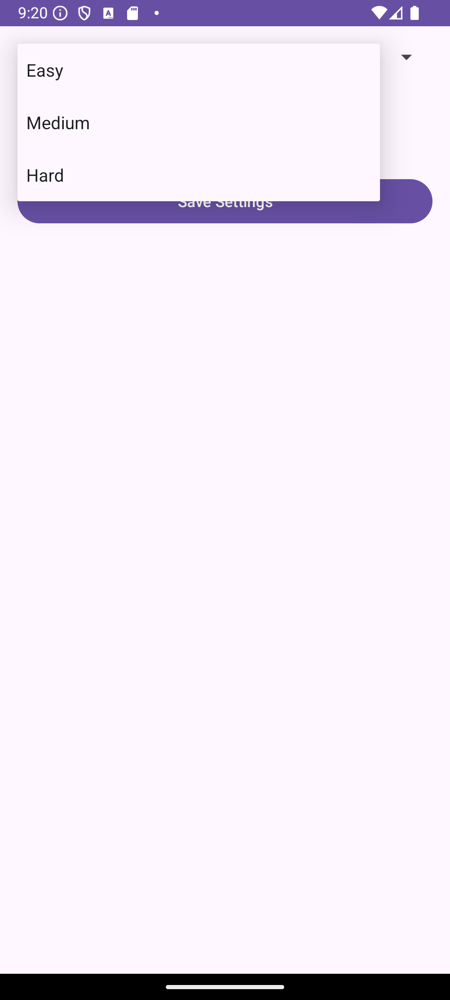
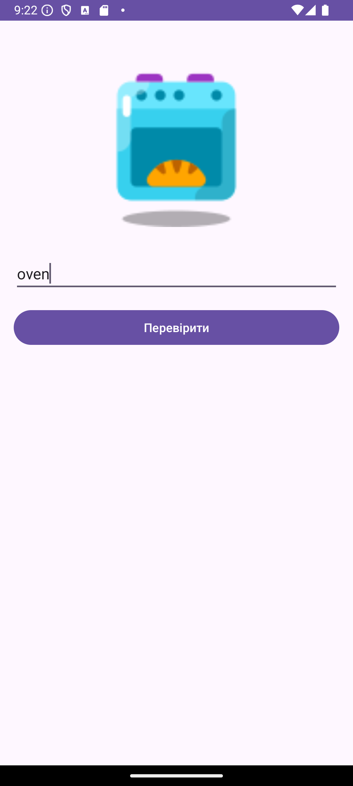
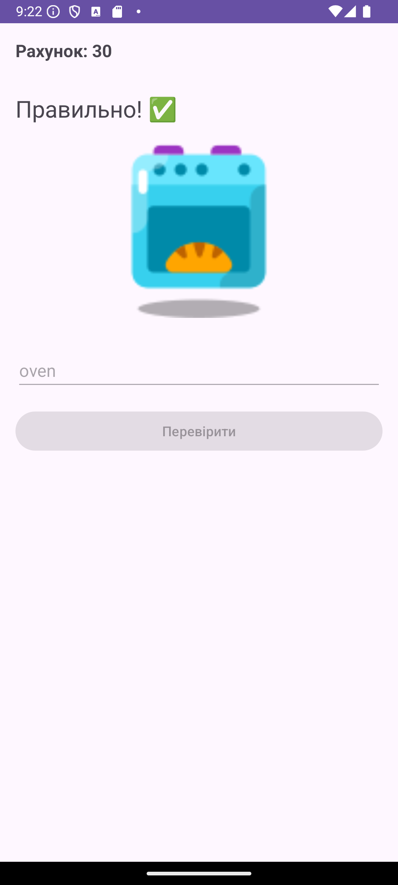
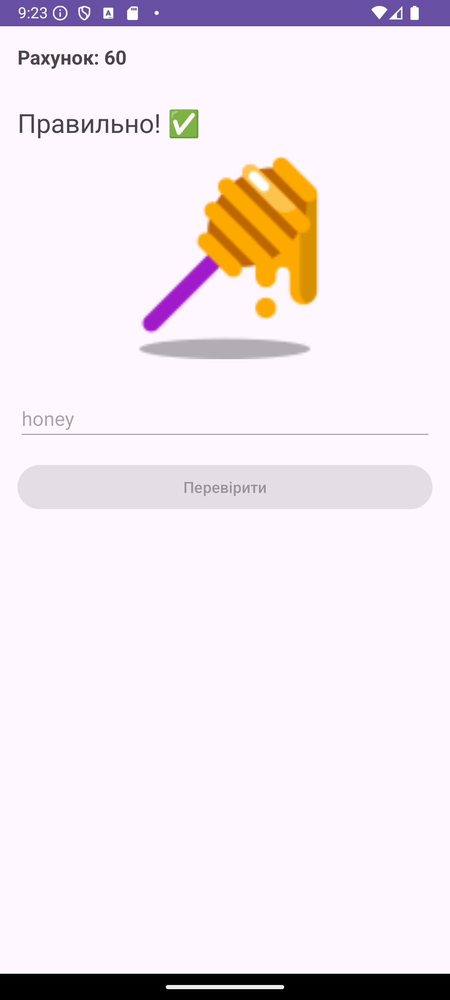
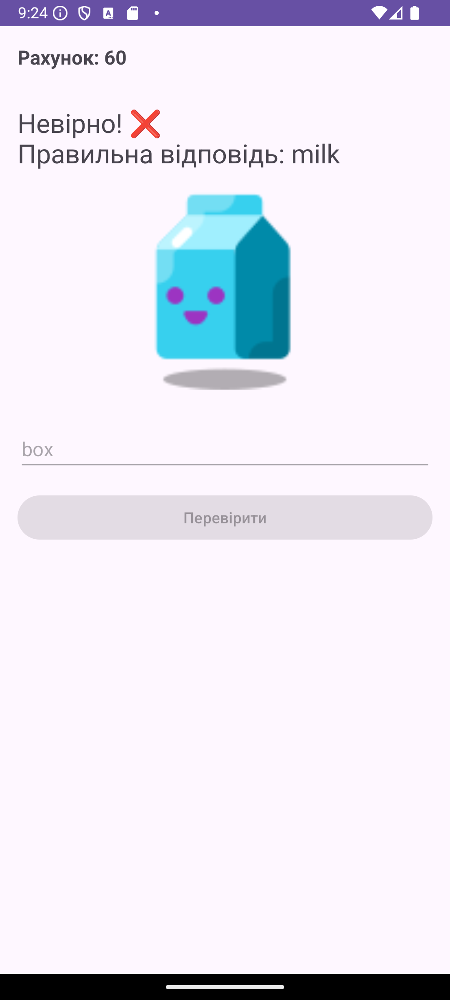
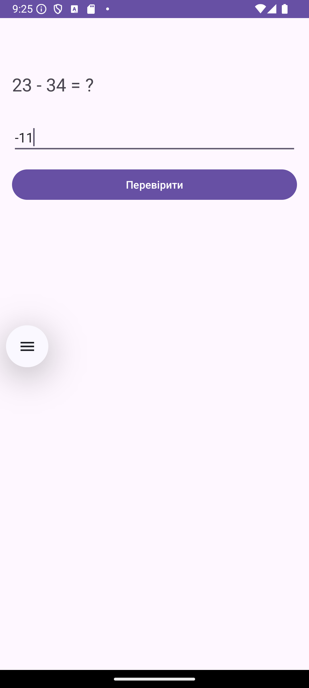
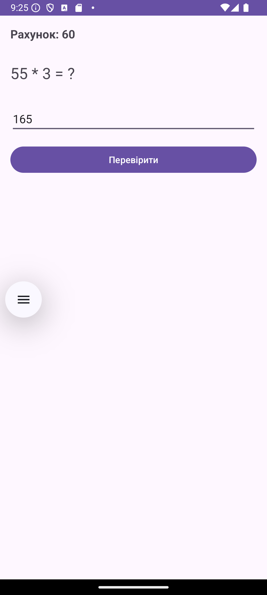
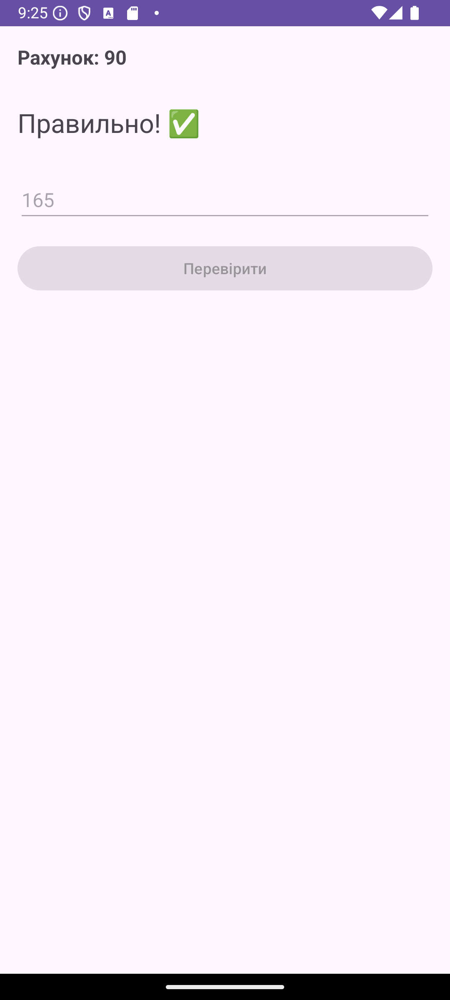

# Android Studio | Homework 09

* [Java Files](./app/src/main/java/com/slavikart/hw_09/)
    - [MainActivity.java](./app/src/main/java/com/slavikart/hw_09/MainActivity.java)
    - [GameActivity.java](./app/src/main/java/com/slavikart/hw_09/GameActivity.java)
    - [SettingsActivity.java](./app/src/main/java/com/slavikart/hw_09/SettingsActivity.java)
    - [ArithmeticTask.java](./app/src/main/java/com/slavikart/hw_09/ArithmeticTask.java)
    - [PictogramTask.java](./app/src/main/java/com/slavikart/hw_09/PictogramTask.java)

* [Layout Files](./app/src/main/res/layout/)
    - [activity_main.xml](./app/src/main/res/layout/activity_main.xml)
    - [activity_game.xml](./app/src/main/res/layout/activity_game.xml)
    - [activity_settings.xml](./app/src/main/res/layout/activity_settings.xml)

* [Value Files](./app/src/main/res/values/)
    - [arrays.xml](./app/src/main/res/values/arrays.xml)
    - [colors.xml](./app/src/main/res/values/colors.xml)
    - [strings.xml](./app/src/main/res/values/strings.xml)
    - [themes.xml](./app/src/main/res/values/themes.xml)

## Brain Training

