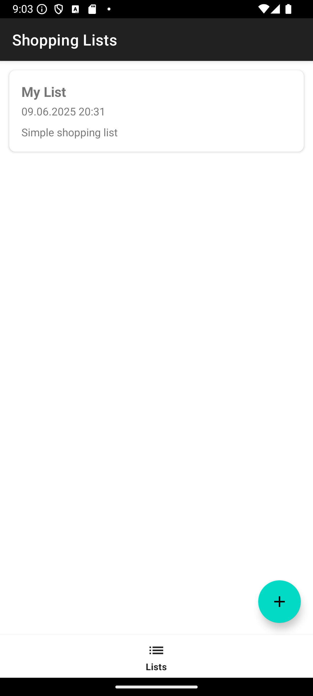
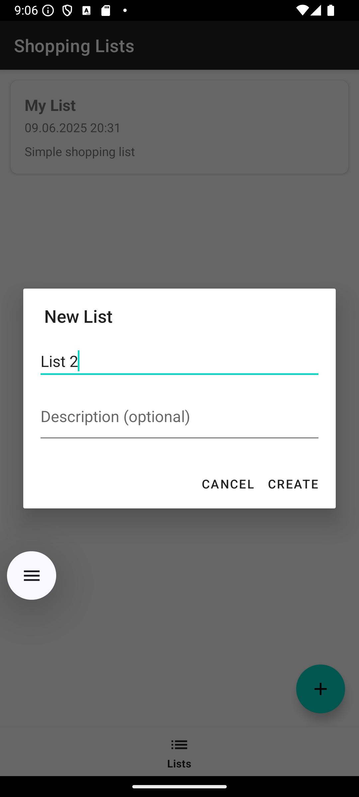
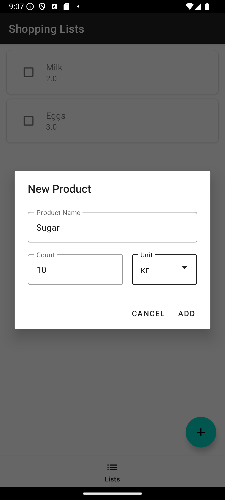
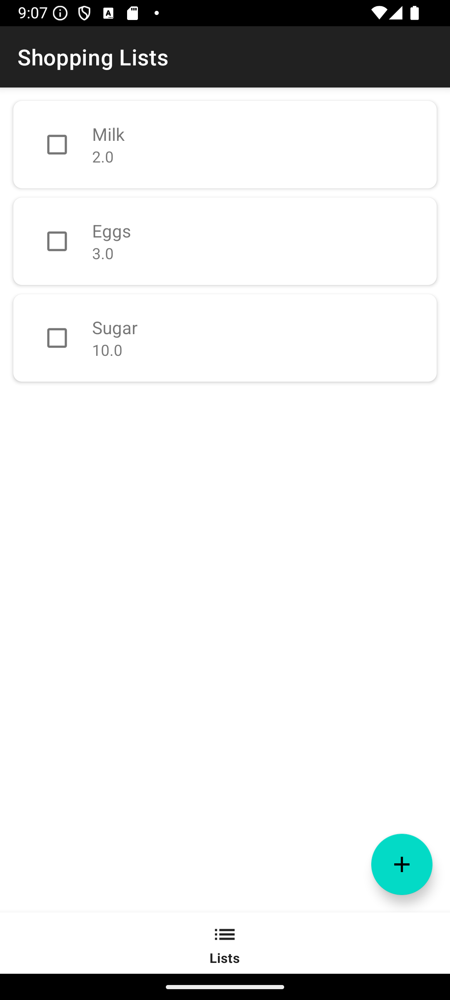
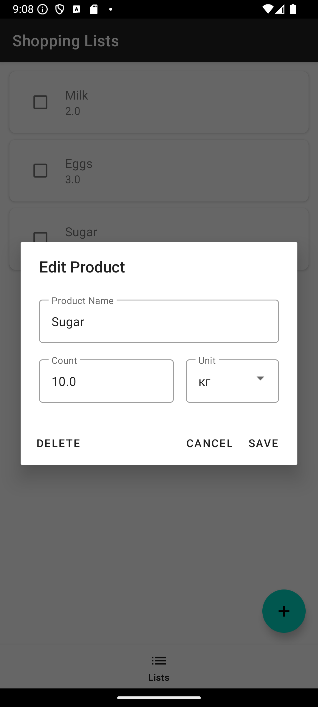
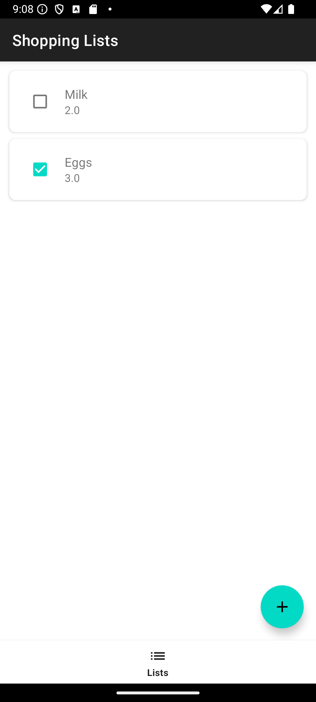

# Android | Homework 10

## Project Structure

* 📁 [app/src/main/java](./app/src/main/java/) - Java Source Code
  * 📁 [com](./app/src/main/java/com/)
    * 📁 [slavikart](./app/src/main/java/com/slavikart/)
      * 📁 [hw_10](./app/src/main/java/com/slavikart/hw_10/)
        * 📄 [MainActivity.java](./app/src/main/java/com/slavikart/hw_10/MainActivity.java)
        * 📁 [adapters](./app/src/main/java/com/slavikart/hw_10/adapters/)
          * 📄 [ListsAdapter.java](./app/src/main/java/com/slavikart/hw_10/adapters/ListsAdapter.java)
          * 📄 [ProductsAdapter.java](./app/src/main/java/com/slavikart/hw_10/adapters/ProductsAdapter.java)
        * 📁 [db](./app/src/main/java/com/slavikart/hw_10/db/)
          * 📄 [DatabaseHelper.java](./app/src/main/java/com/slavikart/hw_10/db/DatabaseHelper.java)
          * 📄 [DatabaseOperations.java](./app/src/main/java/com/slavikart/hw_10/db/DatabaseOperations.java)
        * 📁 [fragments](./app/src/main/java/com/slavikart/hw_10/fragments/)
          * 📄 [ListsFragment.java](./app/src/main/java/com/slavikart/hw_10/fragments/ListsFragment.java)
          * 📄 [ProductsFragment.java](./app/src/main/java/com/slavikart/hw_10/fragments/ProductsFragment.java)
        * 📁 [model](./app/src/main/java/com/slavikart/hw_10/model/)
          * 📄 [Product.java](./app/src/main/java/com/slavikart/hw_10/model/Product.java)
          * 📄 [ShoppingList.java](./app/src/main/java/com/slavikart/hw_10/model/ShoppingList.java)
          * 📄 [Type.java](./app/src/main/java/com/slavikart/hw_10/model/Type.java)

* 📁 [app/src/main/res](./app/src/main/res/) - Resources

* 📁 [app/src/main/res/layout](./app/src/main/res/layout/) - Layouts
  * 📄 [activity_main.xml](./app/src/main/res/layout/activity_main.xml)
  * 📄 [dialog_create_list.xml](./app/src/main/res/layout/dialog_create_list.xml)
  * 📄 [dialog_create_product.xml](./app/src/main/res/layout/dialog_create_product.xml)
  * 📄 [fragment_lists.xml](./app/src/main/res/layout/fragment_lists.xml)
  * 📄 [fragment_products.xml](./app/src/main/res/layout/fragment_products.xml)
  * 📄 [item_list.xml](./app/src/main/res/layout/item_list.xml)
  * 📄 [item_product.xml](./app/src/main/res/layout/item_product.xml)

* 📁 [app/src/main/res/values](./app/src/main/res/values/) - Values
  * 📄 [colors.xml](./app/src/main/res/values/colors.xml)
  * 📄 [strings.xml](./app/src/main/res/values/strings.xml)
  * 📄 [themes.xml](./app/src/main/res/values/themes.xml)

* 📁 [app/src/main/res/drawable](./app/src/main/res/drawable/) - Drawables
  * 📄 [ic_add.xml](./app/src/main/res/drawable/ic_add.xml)
  * 📄 [ic_launcher_background.xml](./app/src/main/res/drawable/ic_launcher_background.xml)
  * 📄 [ic_launcher_foreground.xml](./app/src/main/res/drawable/ic_launcher_foreground.xml)
  * 📄 [ic_list.xml](./app/src/main/res/drawable/ic_list.xml)
  * 📄 [ic_shopping.xml](./app/src/main/res/drawable/ic_shopping.xml)

* 📁 [app/src/main/res/menu](./app/src/main/res/menu/) - Menus
  * 📄 [bottom_nav_menu.xml](./app/src/main/res/menu/bottom_nav_menu.xml)

## Screenshots

