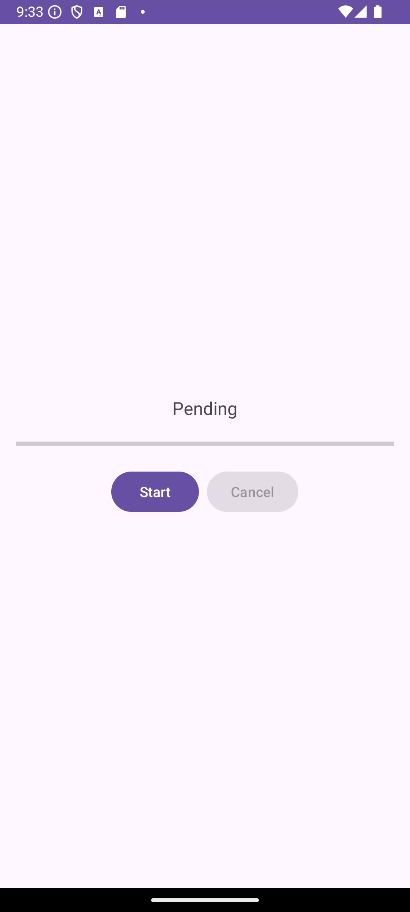

# Android | Homework 11

## Project Structure

* 📁 [app/src/main/java](./app/src/main/java/) - Java Source Code
  * 📁 [com](./app/src/main/java/com/)
    * 📁 [slavikart](./app/src/main/java/com/slavikart/)
      * 📁 [hw_11](./app/src/main/java/com/slavikart/hw_11/)
        * 📄 [MainActivity.java](./app/src/main/java/com/slavikart/hw_11/MainActivity.java)

* 📁 [app/src/main/res](./app/src/main/res/) - Resources

* 📁 [app/src/main/res/layout](./app/src/main/res/layout/) - Layouts
  * 📄 [activity_main.xml](./app/src/main/res/layout/activity_main.xml)

* 📁 [app/src/main/res/values](./app/src/main/res/values/) - Values
  * 📄 [colors.xml](./app/src/main/res/values/colors.xml)
  * 📄 [strings.xml](./app/src/main/res/values/strings.xml)
  * 📄 [themes.xml](./app/src/main/res/values/themes.xml)

* 📁 [app/src/main/res/drawable](./app/src/main/res/drawable/) - Drawables
  * 📄 [ic_launcher_background.xml](./app/src/main/res/drawable/ic_launcher_background.xml)
  * 📄 [ic_launcher_foreground.xml](./app/src/main/res/drawable/ic_launcher_foreground.xml)

## Screenshots

